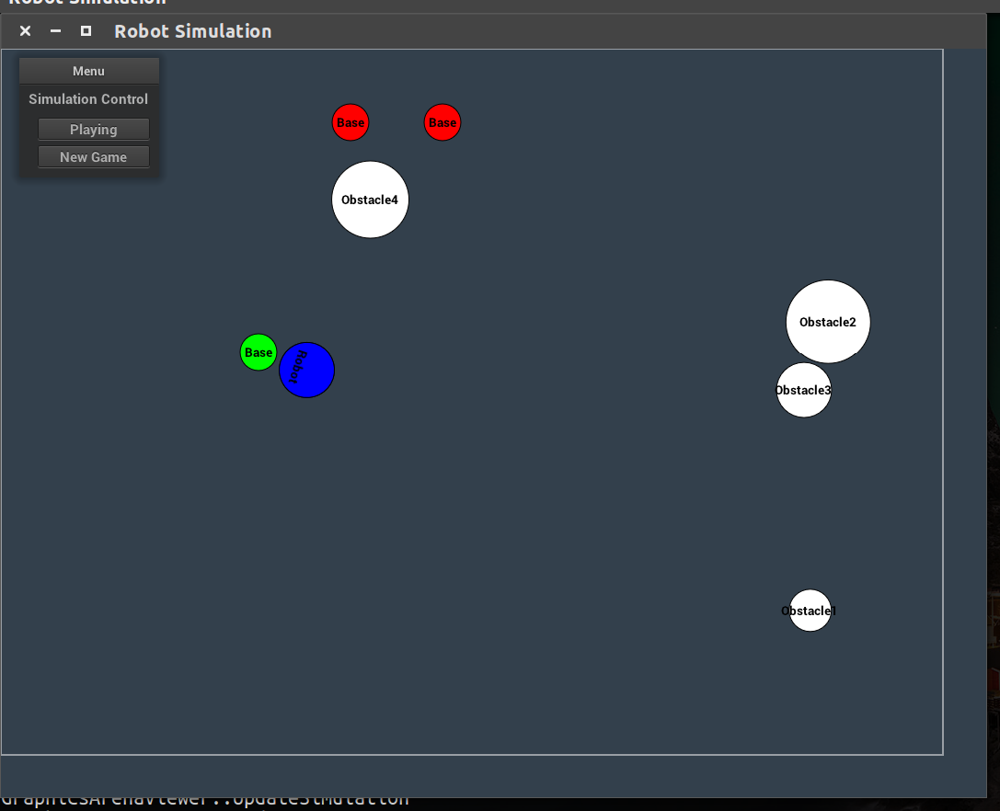

# Robot_Video_Game
Video game built in C++. Play as the robot to capture all the bases while avoiding the obstacles.

## Dependencies

* nanogui
* MinGfx-1.0 (specifiy install location in `src/Makefile`'s `CS3081DIR=/path/to/install`)
* g++ 7

## How to Compile

Change directory to project's `src/` folder and run `make`.

## How to Run

Once compiled, a `build/` folder will automatically be created under the project's root folder. Change directory to the project's root folder and run `./build/bin/arenaviewer'

## How to Play

Hit the `Start Game` button on the top left of the window. This will allow the robot the move using the four arrow keys. Watchout for the moving obstacles while trying to capture all the red bases (if the base is green, it means it is already captured).
